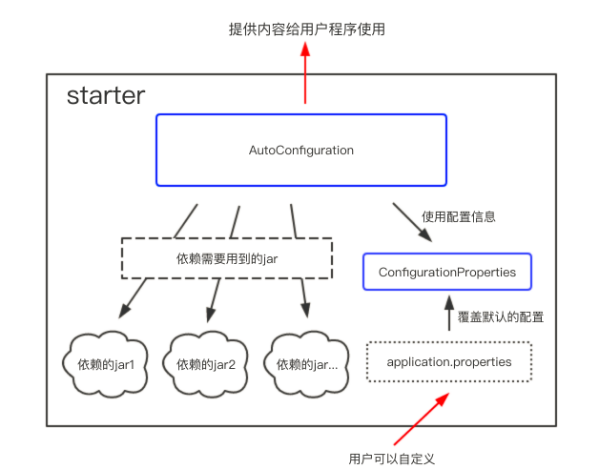

###自定义spring-boot-starter的步骤
why(意义)-what(原理)-how(详细组成)-when(场景)
####starter的目的
starter是一种封箱思想的设计理念,将庞大复杂的流程和配置通过 开箱即用,约定大于配置的设计目标而设计的规范.
场景:通常应用于公共配置服务(日志记录),可重用组件(aliyun-sms),被依赖的前置服务.
starter是一套封装流程,所以有加载顺序,有加载组件,还有加载配置逻辑.

####starter的核心组件
>1.resource/META-INF/spring.factories [指定自动化配置类]
>2.ConfigurationProperties [指定自动化配置的属性]
>3.Configuration/EnableConfigurationProperties [指定自动化配置加载逻辑]
>4.pom.xml[指定starter的父id构建]
####整体逻辑

####使用starter
starter打包后以后,以jar包形式封装成单独的依赖包.
其他业务组件通过maven依赖,如下:
<pre>
 <dependency>
    <groupId>org.springframework.boot</groupId>
    <artifactId>custom-spring-boot-starter</artifactId>
    <version>0.0.1-SNAPSHOT</version>
 </dependency>
</pre>
就可以在业务组件中使用这个公共组件的bean了,而且默认是被spring context托管了.

####如何制作starter
1.创建一个starter工程.[pom.xml添加依赖,artifactid要遵照约定xxx-spring-boot-starter]
<pre>
<parent>
    <groupId>org.springframework.boot</groupId>
    <artifactId>spring-boot-starters</artifactId>
    <version>2.2.6.RELEASE</version>
</parent>
</pre>
2.创建一个ConfigurationProperties.java,用于保存application.properties中读取的配置信息
3.创建一个Configuration.java ,注解@Configuration @EnableConfigurationProperties(CustomProperties.class)
	3.1在该类中实现starter应该完成的操作,比如bean的构造,要把这个类加入spring.factories配置文件中声明
		org.springframework.boot.autoconfigure.EnableAutoConfiguration=\
		com.nosuchfield.httpstarter.HttpAutoConfiguration
	3.2可以写加载逻辑,比如先后顺序,条件加载.
4.打包项目,通过maven依赖starter,就可以在项目中使用starter提供的能力,实现自动注入bean.

####AutoConfiguration中的详细配置有哪些?
![https://docs.spring.io/spring-boot/docs/2.0.0.M5/reference/htmlsingle/#boot-features-condition-annotations]

必备:
@Configuration //容器启动时会自动加载
@EnableConfigurationProperties(CustomProperties.class)

>条件加载
	
>条件装载bean
	@Bean //创建bean实例
    @ConditionalOnMissingBean //当Context缺失该bean时创建,避免重复创建
    @ConditionalOnProperty(prefix = "custom",value = "enabled",havingValue = "true") //属性条件创建
